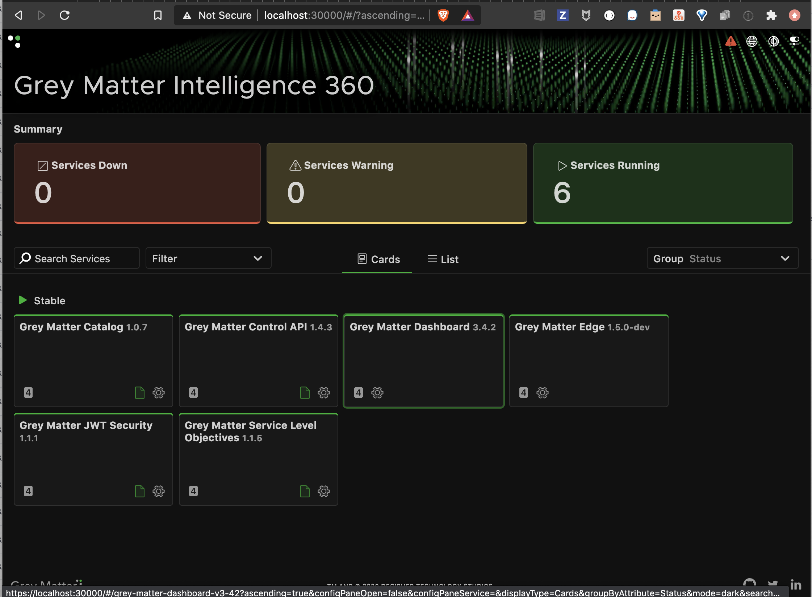

# Using the GitHub Helm Charts

This document will walk you through the process of installing Grey Matter using the GitHub hosted helm charts.

## Add the GitHub Repository

The GitHub repository needs to be added to helm.  Do so by running the following command

```console
helm repo add greymatter https://greymatter-io.github.io/helm-charts
```

## Create Credentials

A Grey Matter LDAP account is still required to pull the images from our Nexus server. Run the following command and provide answers when prompted

```console
make credentials
```

## Installing

The following set of commands will install Grey Matter using the GitHub hosted Helm Charts

```console
$ helm install secrets greymatter/secrets -f credentials.yaml -f global.yaml
$ helm install spire greymatter/spire --set=global.environment=kubernetes -f global.yaml
$ helm install fabric greymatter/fabric --set=global.environment=kubernetes -f global.yaml
$ helm install edge greymatter/edge -f global.yaml
$ helm install sense greymatter/sense -f global.yaml --set=global.waiter.service_account.create=false
$ kubectl patch svc edge -p '{"spec": {"type": "LoadBalancer"}}'
```

## Viewing the Grey Matter Dashboard

At this point, you can verify that Grey Matter was installed successfully by opening your browser and pointing it to `https://localhost:30000` and verify that all six services are running.

