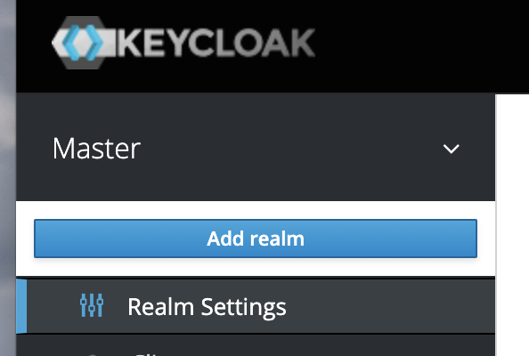
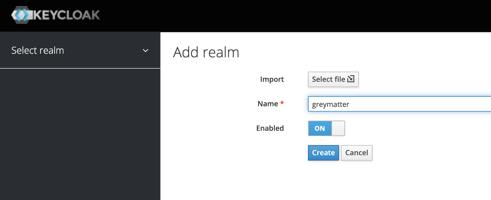
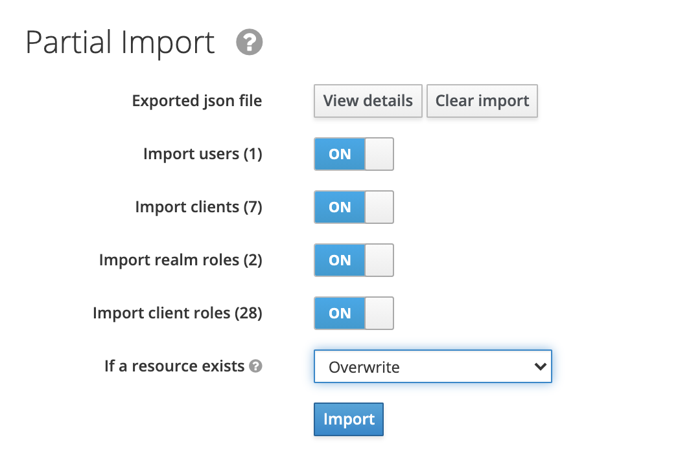
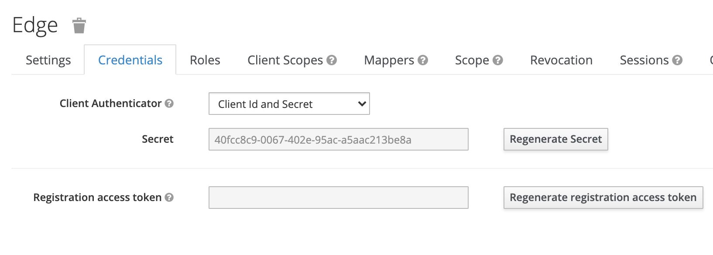
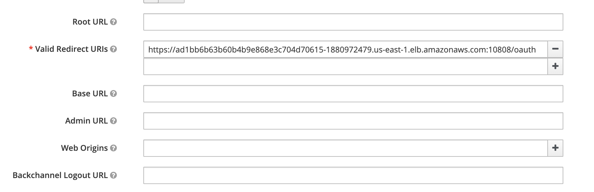
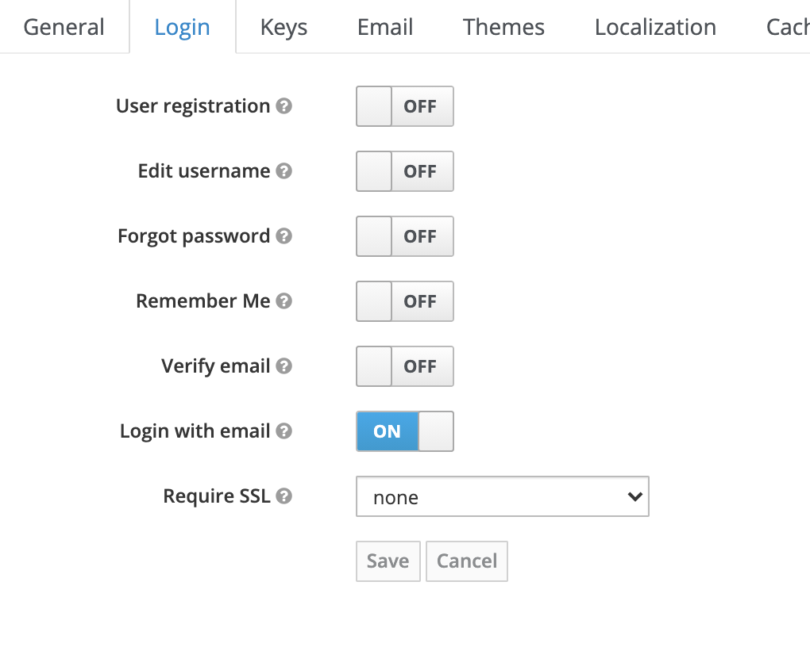
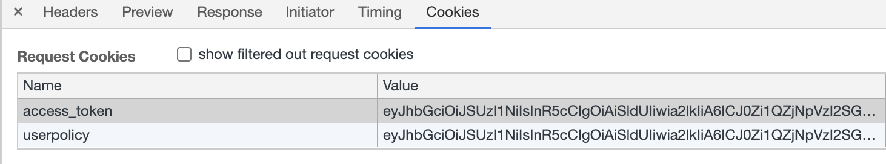

# Deploying Keycloak

### Install Cluster Using Buttermilk Sky

```bash
bs create-kops-cluster --name $NAME --vpc dev2 --publicSubnets
```

See [runbook](https://github.com/greymatter-io/buttermilk-sky/blob/master/docs/content/runbooks/kops_cluster.md) for more information


### Install Grey Matter

```bash
make secrets
make install
```
### Install Keycloak

```bash
make keycloak
```

### Login to Keycloak

Once installed, go to the keycloak admin console through the keycloak ingress:

```bash
echo "https://$(kubectl get svc keycloak-backend -o jsonpath="{.status.loadBalancer.ingress[*].hostname}")/auth/admin/"
```

Since the certificates are self-signed, you may need to type `thisisunsafe` when you get to the page. See [thread](https://miguelpiedrafita.com/chrome-thisisunsafe) for chrome.

Enter credentials:

```bash
echo Username: user
echo Password: $(kubectl get secret --namespace default keycloak-backend -o jsonpath="{.data.admin-password}" | base64 --decode)
```

### Import Grey Matter Realm

Once logged in, hover over the "Master" realm and click "Add Realm."



For the "name" field put `greymatter` and click "Create."



Now click on "Import" on the left hand side of the page. Click on "select file" and select the file `path/to/helm-charts/keycloak/realms/greymatter.json` realm export file. Set the "if resource exists" dropdown to `Overwrite`:



Click "import". You should be taken to a screen which shows successful import and overwriting of data.

### Add Users

Run the script

```bash
(cd keycloak && ./scripts/add_users.sh)
```
Now in the "Users" tab on the left side of the page you should see a table of users. Each user is initialized with the password "password123"

### Edge

Port forward control-api to your machine. We do this because we don't want to be going through the edge as we are making changes to it:

```bash
kubectl port-forward control-api-0 5555 &
```
Set the following greymatter config
```bash
GREYMATTER_API_HOST=localhost:5555
GREYMATTER_API_INSECURE=true
GREYMATTER_API_KEY=<redacted>
GREYMATTER_API_PREFIX=
```

Now go to clients -> edge -> credentials in the keycloak UI and click `regenerate secret`



Run the configure-edge script with that secret:

```bash
export CLIENT_SECRET=xxxxxxx
(cd keycloak && ./scripts/configure_edge.sh)
...
Add to Valid Redirect URIs: https://XXX.com:10808/oauth
```

Now in keycloak go to clients -> edge -> Valid redirect URIs and add the value from above (`https://XXX.com:10808/oauth`):



Last, make sure that Realm settings -> login -> Require SSL is set to `none`




### Login 

Get the edge external service 

```bash
kubectl get svc | grep edge

edge                                   LoadBalancer   100.68.11.58     ad1bb6b63b60b4b9e868e3c704d70615-1880972479.us-east-1.elb.amazonaws.com   10808:30143/TCP,8081:31322/TCP   23h
```
And go to the URL: https://EDGE_DOMAIN:10808. You will be prompted for the quickstart certificate and asked to log in with keycloak. Any of the users work for this (password is `password123`). Once logged in, you should see `access_token` and `userpolicy` cookies are set and passed with each request through the edge:



